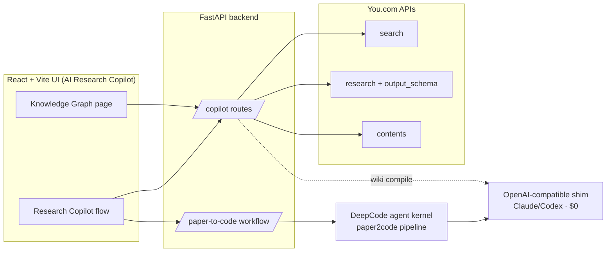
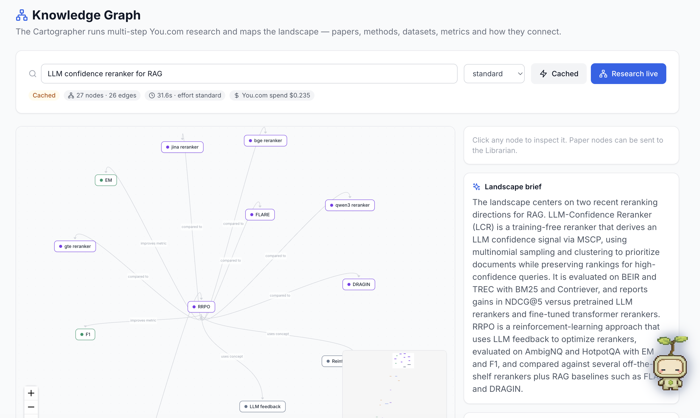

# AI Research Copilot

**Discover → Map → Summarize → Reproduce.** A personal AI research partner that
finds the papers that matter, maps a whole field as a live **knowledge graph**,
compiles papers into your wiki, and then **reproduces a chosen paper as running
code** — all in one app.

Built for the You.com Agentic Hackathon. The demo hero: watch a freshly
discovered paper become a working, evaluated reproduction.

---

## Why it's different

Most "chat with papers" tools stop at summaries. AI Research Copilot closes the
loop from *discovery* to *running code*, and does three things that are genuinely
novel:

1. **A knowledge graph in a single grounded call.**
   We drive the **You.com Research API with a structured `output_schema`**, so
   one agentic, multi-step web-research call returns a *typed* graph
   (papers · methods · datasets · metrics · concepts) **with cited sources** —
   not a wall of text we have to post-process. See
   [`graph_service.py`](DeepCode/new_ui/backend/services/graph_service.py).

2. **A team of named agents over a reused engine.**
   Scout, Cartographer, Librarian, Architect, Engineer and Reviewer are thin,
   legible roles on top of proven infrastructure (You.com APIs + the DeepCode
   agent kernel) rather than yet another orchestration framework.

3. **Zero-cost, demo-safe reproduction.**
   An OpenAI-compatible **shim** routes the reproduction's LLM calls through a
   local Claude/Codex subscription ($0 API spend), and the hero reproduction is
   **pre-baked with a live veneer** so the on-stage payoff is guaranteed.

---

## The agent team

| Agent | Role | Powered by |
|-------|------|------------|
| **Scout** | Discovers recent, relevant papers | You.com `search` |
| **Cartographer** | Maps the field as a knowledge graph | You.com `research` + structured `output_schema` |
| **Librarian** | Compiles a paper into a wiki article | You.com `contents` + LLM (via shim) |
| **Architect** | Clarifies scope and plans the reproduction | DeepCode planning + plan-review gate |
| **Engineer** | Generates and runs the reproduction code | DeepCode implementation + compute tools |
| **Reviewer** | Security + architecture audit of the repo | Opsera DevSecOps |

---

## Architecture



The app **extends DeepCode's** React+FastAPI application as its spine (reusing the
streaming paper2code UI) and adds Discovery, the Knowledge Graph, and the Wiki as
first-class surfaces. See [ADR-0001](docs/adr/0001-extend-deepcode-web-app-as-spine.md).

---

## Deeper You.com integration

- **`search`** — Scout finds candidate papers (arXiv-filtered, freshness-bounded).
- **`research` + `output_schema`** — the Cartographer's headline call: agentic
  multi-step research returning a typed knowledge graph **and** cited sources.
  Efforts: `standard` (~30–90s), `deep`, `exhaustive`. Results are cached to
  `wiki/graph/` so the demo loads instantly and can refresh live.
- **`contents`** — the Librarian extracts full paper text for wiki compilation.
- **Live spend meter** — approximate per-call You.com cost is tracked and shown
  in the UI (`/copilot/spend`).

> Note: `api.you.com` sits behind Cloudflare and 403s the default urllib
> User-Agent (error 1010); the client sends a browser UA to get through.

---

## The Knowledge Graph (headline feature)

Open **Knowledge Graph** in the app, type a research area, and the Cartographer
returns an interactive, force-directed map:

- Nodes are typed and color-coded: papers, methods, datasets, metrics, concepts.
- Edges are labeled relations: `proposes`, `builds_on`, `evaluates_on`,
  `uses_retriever`, `improves_metric`, …
- Click any node for detail; **paper nodes can be sent straight to the Librarian**.
- A cited **landscape brief** and source list sit alongside the graph.

Example (LLM confidence reranking for RAG): **~44 nodes / ~45 edges / cited
arXiv sources**, generated by one You.com research call.



---

## The reproduction (hero)

The locked demo target is the **LLM-Confidence Reranker (LCR)** paper — a
training-free, plug-and-play reranker (MSCP confidence + binning) evaluated with
NDCG@5 on small BEIR sets. It's chosen for reliability: no GPU training, tiny
corpus, crisp metric. See [ADR-0002](docs/adr/0002-prebaked-reproduction-of-lcr-paper.md)
and the [reproduction spec](docs/reproduction-spec-lcr.md).

The Engineer generates a full, runnable repo (`confidence/`, `lcr/`,
`retrievers/`, `rerankers/`, `eval/`, `data/`, `run.py`), served to the UI via
the pre-bake endpoints (`/copilot/prebaked`).

---

## Running it

```bash
# 1) Start the zero-cost LLM shim (routes to your Claude/Codex subscription)
python3 copilot_shim/openai_shim.py

# 2) Start the app (DeepCode's launcher runs FastAPI + Vite together)
cd DeepCode && .venv/bin/deepcode --local
# UI:      http://localhost:5173
# backend: http://localhost:8000
```

You.com access uses a key in `.mcp.json` (gitignored) or `YDC_API_KEY`.

---

## Repository layout

```
AI-Research-Copilot/
├── DeepCode/            # vendored engine (github.com/HKUDS/DeepCode, MIT) + our integration
│   └── new_ui/
│       ├── backend/services/{youcom_service,graph_service,librarian_service}.py
│       ├── backend/api/routes/copilot.py
│       └── frontend/src/pages/{CopilotPage,KnowledgeGraphPage}.tsx
├── copilot_shim/        # OpenAI-compatible shim -> Claude/Codex subscription ($0)
├── wiki/                # personal knowledge base (llm-wiki format) + graph/ cache
├── docs/adr/            # architecture decision records
├── docs/reproduction-spec-lcr.md
└── CONTEXT.md           # project glossary / ubiquitous language
```

---

## Credits

- **DeepCode** — the agentic coding engine we extend as our spine.
  © Data Intelligence Lab @ HKU ([HKUDS/DeepCode](https://github.com/HKUDS/DeepCode), MIT).
  Our integration lives under `DeepCode/new_ui/`; the original project retains
  full credit, and its upstream git history is preserved at
  `DeepCode/.git.upstream-HKUDS`.
- **You.com** — Search, Research and Contents APIs power discovery, the knowledge
  graph, and wiki compilation. Patterns follow the
  [You.com agent starter kit](https://github.com/nvdm59/youcom-agent-starter-kit).
- **karpathy-llm-wiki** — the wiki article format the Librarian targets.
